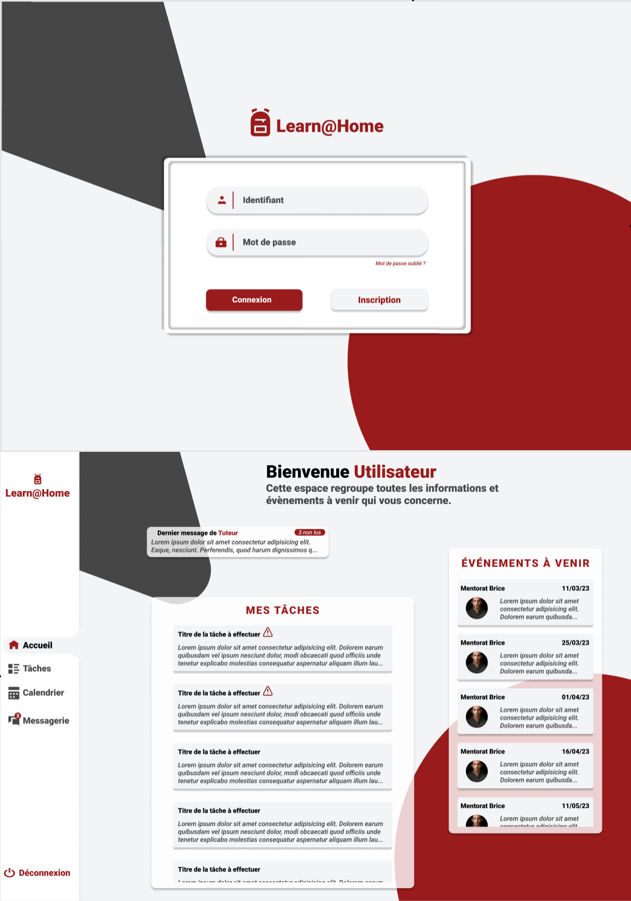

# Learn@Home-OCR

Project de formation chez OpenClassRoom.

# Langage solicité:

- Aucun

# Objectif

- Définir besoins d'une app
- Réalisation Diagramme cas d'usage
- Maitrise figma et réalisation maquette 
- Réalisation user stories
- Réalisation kanban

# Visiter

- [FIGMA](https://www.figma.com/file/XYplrUx19n8RhQKCYcYiEk/Untitled?node-id=0-1&t=Emm20m7TfgSK0TaR-0)
- [Diagramme cas D'usage](https://github.com/Nerion-1337/LearnHome-OCR/blob/master/Digramme%20cas%20d'Usage.png)

# Aperçu

